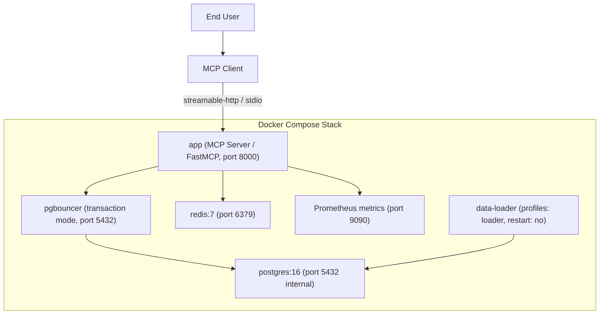

# 部署架構圖

## 關鍵考量

1. **資料持久性**：PostgreSQL 資料存放於 Docker Volume，容器重啟後資料保留，無需重新執行 data-loader。
2. **通訊模式**：生產環境使用 `streamable-http`（port 8000）；本地 Claude Desktop 整合使用 `stdio` 模式。可透過 `MCP_TRANSPORT` 環境變數切換。
3. **pgBouncer transaction mode**：不相容 `LISTEN/NOTIFY` 和 named prepared statements，asyncpg 需設 `statement_cache_size=0`。
4. **data-loader 容器**：`profiles: [loader]`，`restart: "no"`，直接連接 PostgreSQL（繞過 pgBouncer）以進行大量寫入。
