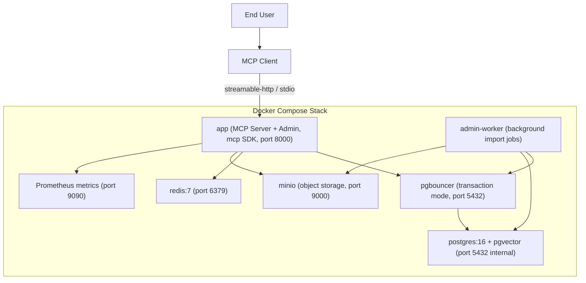

# 部署架構圖

## 關鍵考量

1. **資料持久性**：PostgreSQL 與 MinIO 資料存放於 Docker Volume，容器重啟後資料保留，無需重新匯入。
2. **通訊模式**：生產環境使用 `streamable-http`（port 8000）；本地 Claude Desktop 整合使用 `stdio` 模式。可透過 `MCP_TRANSPORT` 環境變數切換。
3. **pgBouncer transaction mode**：不相容 `LISTEN/NOTIFY` 和 named prepared statements，asyncpg 需設 `statement_cache_size=0`。
4. **資料匯入**：由管理後台觸發、`admin-worker` 背景執行（已無獨立的 data-loader 容器）；大量寫入時直接連接 PostgreSQL（繞過 pgBouncer）。
5. **MinIO**：儲存藥品文件資產（仿單 / 標籤 / 外觀圖），工具回傳有時效的預簽下載連結。
