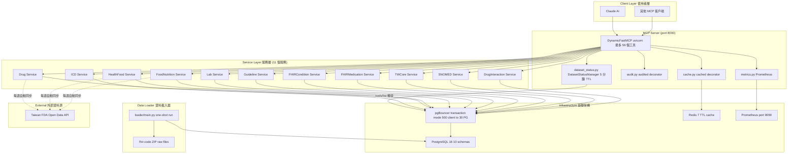

# 系統架構

Taiwan Health MCP Server 採用 PostgreSQL 作為主要資料庫，透過 pgBouncer 連線池、Redis 快取、Prometheus 監控，支援生產環境高並發需求。

---

## 📐 整體架構



---

## 🏗️ 基礎架構元件

| 元件 | 版本 | 用途 |
|------|------|------|
| PostgreSQL | 16-alpine | 主要資料庫，存放所有術語資料 |
| pgBouncer | edoburu/latest | 連線池（transaction mode）；500 client 連線 → 30 PG 連線 |
| Redis | 7-alpine | 回應快取（TTL 策略），`@cached` 裝飾器 |
| Prometheus | — | 工具呼叫計數器、延遲 histogram、DB pool 指標（port 9090） |

### pgBouncer 設定要點

- 模式：`transaction` — 每次查詢結束後釋放 PG 連線，支援最高並發
- asyncpg 必須設定 `statement_cache_size=0` — transaction mode 不支援 named prepared statements
- 不相容：`LISTEN/NOTIFY`、server-side cursors

### PostgreSQL Schema

```
audit          -- 查詢稽核日誌（SHA-256 參數雜湊）
icd            -- ICD-10-CM 診斷碼、ICD-10-PCS 手術碼
drug           -- 台灣 FDA 藥品（licenses/appearance/ingredients/atc/documents）
health_food    -- 台灣 FDA 核可健康食品
food_nutrition -- 食品營養成分、食品原料
loinc          -- LOINC 2.80 檢驗碼、參考值
guideline      -- 台灣臨床診療指引
twcore         -- TWCore IG v1.0.0 CodeSystem
snomed         -- SNOMED CT International RF2
rxnorm         -- RxNorm 藥品命名與交互作用
```

完整 DDL：`db/schema.sql`（PostgreSQL 容器首次啟動時自動套用）

---

## 🔧 服務層（11 個服務）

| 服務 | 檔案 | 資料來源 | 同步方式 |
|------|------|----------|---------|
| ICD Service | `icd_service.py` | `icd.diagnoses` / `icd.procedures` | data-loader（靜態） |
| Drug Service | `drug_service.py` | `drug.*` | FDA Open Data，每週二 02:00 UTC |
| Health Food Service | `health_food_service.py` | `health_food.items` | FDA Open Data，每週一 02:30 UTC |
| Food Nutrition Service | `food_nutrition_service.py` | `food_nutrition.*` | FDA Open Data，每週一 03:00 UTC |
| Lab Service | `lab_service.py` | `loinc.*` | data-loader（LOINC 2.80 zip） |
| Clinical Guideline Service | `clinical_guideline_service.py` | `guideline.*` | data-loader（種子資料） |
| FHIR Condition Service | `fhir_condition_service.py` | 讀取 `icd.diagnoses` | — |
| FHIR Medication Service | `fhir_medication_service.py` | 讀取 DrugService | — |
| TWCore Service | `twcore_service.py` | `twcore.*` | data-loader + 即時抓取備援 |
| SNOMED Service | `snomed_service.py` | `snomed.*` | data-loader（RF2 zip） |
| Drug Interaction Service | `drug_interaction_service.py` | `rxnorm.*` | data-loader（RxNorm zip） |

---

## 🔁 跨切面關注點（Cross-cutting Concerns）

### `src/audit.py` — 查詢稽核
```python
@audited("tool_name")
async def my_tool(...):
    ...
```
- 記錄 SHA-256(params)、工具名稱、執行時間、狀態到 `audit.query_log`
- 絕不記錄原始參數值（HIPAA 合規）
- 自動呼叫 `metrics.record_tool_call()`

### `src/cache.py` — Redis 快取
```python
@cached(ttl=3600, prefix="icd")
async def search_codes(...):
    ...
```
- 快取鍵：`mcp:{prefix}:{sha256(args)[:16]}`
- Fail-open：Redis 錯誤時直接執行原始函數
- 自動呼叫 `metrics.record_cache_op()`

### `src/metrics.py` — Prometheus 指標

| 指標名稱 | 類型 | 說明 |
|---------|------|------|
| `mcp_tool_requests_total` | Counter | 工具呼叫次數（依工具名稱和狀態） |
| `mcp_tool_duration_seconds` | Histogram | 工具執行延遲 |
| `mcp_cache_operations_total` | Counter | 快取命中/未命中/錯誤 |
| `mcp_db_pool_size` | Gauge | asyncpg pool 總連線數 |
| `mcp_db_pool_checked_out` | Gauge | 目前使用中的連線數 |

### `src/utils.py` — 結構化日誌
- 輸出至 `stderr`（stdout 保留給 MCP stdio transport）
- 每行一個 JSON 物件：`{"ts", "level", "logger", "msg", ...extra}`
- 日誌等級透過 `LOG_LEVEL` 環境變數設定

### `src/database.py` — asyncpg Pool 單例
- `init_pool()` 冪等（Idempotent）：若已初始化則回傳現有 pool
- `statement_cache_size=0` 必須設定（pgBouncer transaction mode 要求）

---

## 🔀 動態工具啟用/停用

MCP 工具清單依資料集載入狀態動態變化，未載入的資料集對應工具完全不出現在 `tools/list` 回應中。

### 機制

```
client 呼叫 tools/list
    └─→ DynamicFastMCP.list_tools()
            └─→ DatasetStatusManager.refresh_if_stale_and_sync()
                    ├─ 快取仍新鮮（< 5 分鐘）→ 直接略過
                    └─ 快取過期 → 查詢各 schema COUNT(*)
                            ├─ 資料量 ≥ 門檻 → 服務可用 → add_tool()
                            └─ 資料量 < 門檻 → 服務不可用 → remove_tool()
```

### 服務與門檻對照

| 服務 | 查詢表 | 最低門檻 | 說明 |
|------|--------|---------|------|
| ICD | `icd.diagnoses` | 10,000 | ICD-10-CM 完整載入約 46,000 筆 |
| Drug | `drug.licenses` | 100 | FDA 藥品通常 > 60,000 筆 |
| Health Food | `health_food.items` | 10 | — |
| Food Nutrition | `food_nutrition.measurements` | 10 | — |
| Lab | `loinc.concepts` | 1,000 | LOINC 2.80 約 100,000 筆 |
| Guideline | `guideline.disease_guidelines` | 1 | — |
| TWCore | `twcore.codesystems` | 1 | — |
| SNOMED CT | `snomed.concepts` | 100,000 | 完整約 370,000 筆 |
| RxNorm | `rxnorm.concepts` | 10,000 | — |
| FHIR Condition | — | — | 跟隨 ICD 服務 |
| FHIR Medication | — | — | 跟隨 Drug 服務 |

### 門檻的作用

門檻設計用於防止 data-loader 執行中途（資料尚不完整）就開放工具。FDA 同步服務（Drug/HealthFood/FoodNutrition）採用 `TRUNCATE + INSERT` transaction，同步期間資料量為 0，自然被過濾。

### 永遠可見的工具

`health_check` 透過 `@mcp.tool()` 靜態註冊，不受動態機制控制，任何情況下都出現在 tool list。

---

## ⚡ mcp SDK Lifespan 行為（重要）

在 `streamable-http` 模式下，`mcp` SDK 的 `FastMCP` 對每個新的 MCP session 執行一次 lifespan context manager，而非只在程序啟動時執行一次。

`server.py` 使用以下機制確保只初始化一次：

```python
_init_lock: asyncio.Lock   # lazily created on first session
_initialized: bool = False

async with _init_lock:
    if not _initialized:
        # 所有初始化邏輯...
        _initialized = True
# yield 在 lock 外
```

各元件也各自具備冪等保護：
- `database.init_pool()` — 檢查 `_pool is not None`
- `cache.init_client()` — 檢查 `_client is not None`
- `metrics.start_metrics_server()` — `_metrics_server_started` flag
- 各 sync service — `asyncio.Lock` 防止並發同步，`if not scheduler.running` 防止重複啟動

---

## 🔄 FDA 同步策略（Two-Phase Pattern）

所有 FDA 同步函式遵循此模式防止資料庫進入部分寫入狀態：

```
Phase 1: 先抓取所有 HTTP 資料（在 DB 連線外）
Phase 2: 單一 transaction 寫入（TRUNCATE + INSERT）
```

**原始資料去重**：FDA API 偶爾包含重複的主鍵（如 `license_id`）。各服務在 INSERT 前以 `seen_ids` set 去重。

**絕不**在 transaction 內進行 HTTP 請求。

---

## 📦 資料載入器（Data Loader）

`loader/main.py` — 獨立 Docker 容器（`profiles: [loader]`，`restart: "no"`）

- 直接連接 PostgreSQL（繞過 pgBouncer）適合大量寫入
- 來源檔案掛載於 `/app/fhir-code/`（唯讀）

| 參數 | 資料集 | 預估時間 |
|------|--------|---------|
| `--icd` | ICD-10-CM 2025 | < 1 分鐘 |
| `--loinc` | LOINC 2.80 | 1-3 分鐘 |
| `--twcore` | TWCore IG v1.0.0 | < 1 分鐘 |
| `--guideline` | 臨床指引種子資料 | < 1 分鐘 |
| `--snomed` | SNOMED CT International RF2 | 5-15 分鐘 |
| `--rxnorm` | RxNorm Full Release | 5-10 分鐘 |
| `--all` | 全部 | 15-30 分鐘 |
